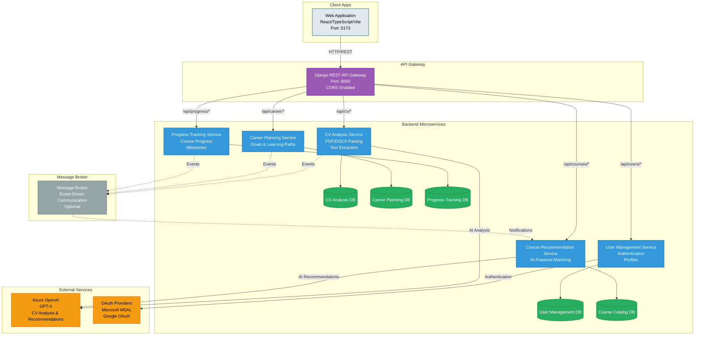

# Career Coach Application Architecture Diagram

## Architecture Overview

### Client Layer
- **Web Application**: React-based SPA running on port 5173
- Features: Dashboard, Course Recommendations, Skills Assessment, Career Path Planner, Job Market Insights, Interview Prep, Career Goals, Profile

### API Gateway Layer
- **Django REST API Gateway**: Single entry point on port 8000
- Handles CORS, routing, and request/response transformation
- Routes requests to appropriate microservices

### Microservices Layer

1. **CV Analysis Service**
   - Processes CV uploads (PDF/DOCX)
   - Extracts text and analyzes content
   - Identifies skills, experience, strengths, weaknesses
   - Integrates with Azure OpenAI for AI-powered analysis

2. **Career Planning Service**
   - Manages user career goals
   - Generates personalized learning paths
   - Tracks skill gaps and development areas

3. **Progress Tracking Service**
   - Monitors course completion
   - Tracks milestone achievements
   - Records learning progress

4. **User Management Service**
   - Handles user authentication
   - Manages user profiles
   - Integrates with OAuth providers (Microsoft, Google)

5. **Course Recommendation Service**
   - Generates personalized course recommendations
   - Uses AI to match courses with user skills and goals
   - Integrates with Azure OpenAI for intelligent matching

### External Services
- **Azure OpenAI**: Provides AI capabilities for CV analysis and course recommendations
- **OAuth Providers**: Microsoft MSAL and Google OAuth for authentication

### Data Layer
Each microservice maintains its own database:
- SQLite (development) / PostgreSQL (production)
- Data isolation and independent scaling

### Communication Patterns
- **Synchronous**: REST API calls through Gateway
- **Asynchronous**: Event-driven communication via Message Broker (optional)

